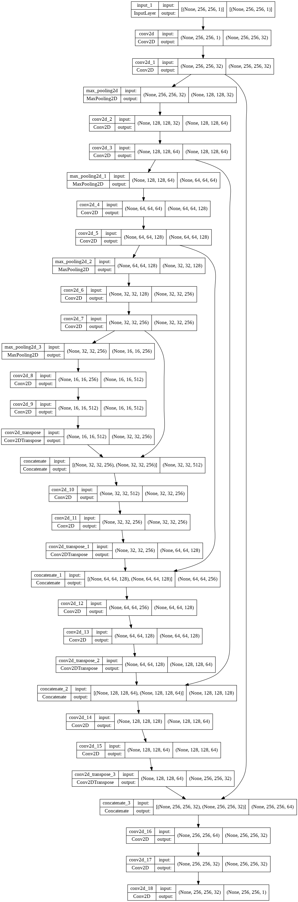

# Special Problem (Repo for our special problem 1 and 2)

## Dataset

<b>From SPIE-AAPM-NCI PROSTATEx Challenges (PROSTATEx)</b>
* https://wiki.cancerimagingarchive.net/pages/viewpage.action?pageId=23691656

## Data Preparation

<b>dicom to tiff conversion</b>
```
pip install dicom2jpg
```
```
dicom_path = '../dicom'
output_path = '../out_dicom'
dicom2jpg.dicom2tiff(dicom_path, target_root=output_path, anonymous=False, multiprocessing=True)
```
<b> Use Labelme Tool </b>

<p align="center">
  
</p>

<br>
&emsp;Save .json mask in ./json folder

<b>Run ```labelme_to_json_batch.py```</b>
<br>
&emsp;<i>Get mask</i> -> <b>Run</b> ```tiff_convert.py ```

<b>Data Partition : </b> &emsp; <i>(80 : 20, 'Train' : 'Validation')</i>


<b>Read Data</b>

<p align="center">
  
</p>

## Pre-processing

<b>```Run dataprep.py```</b>

<b> Prostate : </b> <i>Read -> Resize -> Histogram Equalization -> save to .npy</i>

<p align="center">
  
</p>

<b> Mask : </b> <i>Read -> Resize and Grayscale -> save to .npy</i>

<p align="center">
  
</p>

## Model Architecture

<br>

<p align="center">
  
</p>


## Model Accuracy and Loss

<p align="center">
  
  
</p>

<br>
<b>Predictions : </b>
<br>

<p align="center">
  
</p>

## References

* https://pyimagesearch.com/2022/02/21/u-net-image-segmentation-in-keras/
* https://github.com/jocicmarko/ultrasound-nerve-segmentation.git
* https://towardsdatascience.com/metrics-to-evaluate-your-semantic-segmentation-model-6bcb99639aa2#
